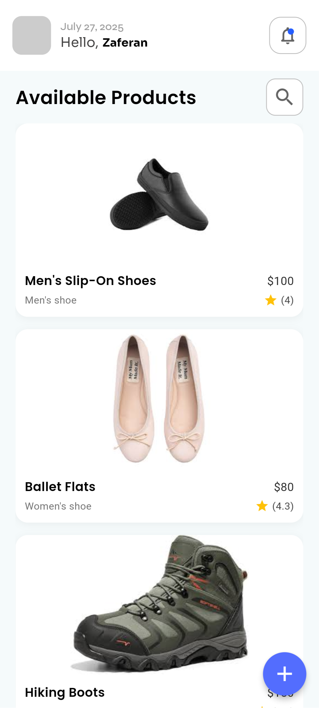
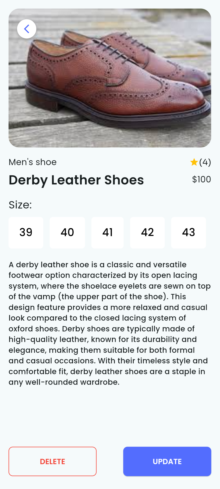
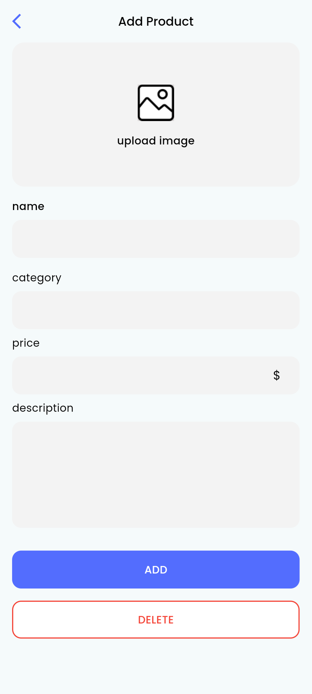
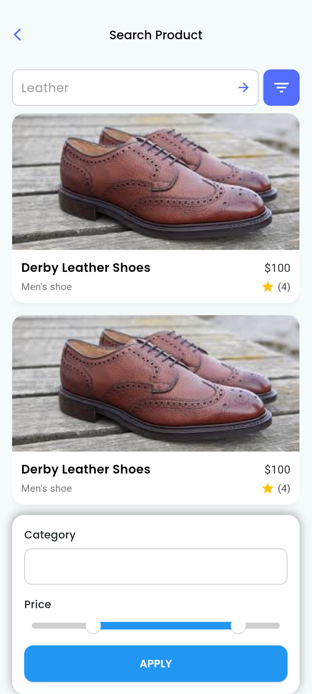

# Flutter E-Commerce UI Showcase

A beautifully designed **Flutter UI project** for an e-commerce app, created as part of the **A2SV (Africa to Silicon Valley) project phase** to demonstrate clean UI building practices. The app is designed strictly for **educational** use, helping learners understand layout, reusable widgets, and UI design patterns in Flutter.

---

## 🖼️ Screenshots

| Home Screen | Details Screen |
|-------------|----------------|
|  |  |

| Add Product | Search Page |
|-------------|--------------|
|  |  |

---

## ✨ Features

- 🛍️ Product card with image, name, category, gender, price, and rating
- 📱 1-column product list layout
- 🔍 Search with price range filtering
- ✏️ Add/update product form
- 🧱 Modular widget and model structure
- 🎨 Google Fonts and consistent styling

---

## 📁 Folder Structure

```

lib/
├── icons/               
├── model/                   # Data models
│   ├── product.dart
│   └── products\_repository.dart
├── pages/                   # Main screens
│   ├── add\_update\_page.dart
│   ├── details\_page.dart
│   ├── home\_page.dart
│   └── search\_page.dart
├── widgets/                 # Reusable widgets
│   ├── app\_bar\_content.dart
│   └── product\_card.dart

````

---

## ⚙️ Getting Started

### Prerequisites

- [Flutter SDK](https://flutter.dev/docs/get-started/install)
- Emulator or physical device
- Code editor (VS Code recommended)

### 🔧 Run the App

```bash
flutter pub get
flutter run
````

### 🖼️ Add Assets

Make sure the image paths are registered in your `pubspec.yaml`:

```yaml
flutter:
  assets:
    - images/
```

---

## 🧰 Tech Stack

* [Flutter](https://flutter.dev/)
* [Dart](https://dart.dev/)
* [Google Fonts](https://pub.dev/packages/google_fonts)

---

## 🎓 Educational Purpose

This UI-only Flutter project was developed as part of the **A2SV Training Program, Project Phase**
It focuses entirely on **frontend design and layout**, with no backend or authentication logic.

---

## 👩‍💻 Author

**Zaferan Miftah**
---

## 📄 License

This project is shared **for educational use only**.
You are welcome to explore, reference, and build upon the UI structure for learning purposes.

---